# Assignment 2 Mind Map - HarborFlow Port Intelligence Console

Sources: `docs/specifications/00-*.txt` and `01`-`10` task briefs (the PDF stays authoritative).

## Mermaid mind map

```mermaid
mindmap
  root(("Assignment 2<br/>Port Intelligence Console"))
    Project setup
      ["Run: python main.py<br/>from project root"]
      ["Relative paths only<br/>rooted at project dir"]
      ["Keep supplied structure"]
      ["Read data/ read-only"]
      ["Outputs -> exports/"]
      ["Task 9 cache -><br/>dataset/incident-index.json"]
    Console shell - Task 0
      ["Persistent menu loop"]
      ["Loop-state variable<br/>no exit(), no break"]
      ["Menu text exact,<br/>order preserved"]
      ["Error: Error - Select a<br/>service from 1 to 10."]
      ["Re-ask until valid choice"]
      ["Dispatch 1-9 to<br/>separate services"]
      ["Close msg printed once<br/>Console closed...safe."]
    Modules
      ["main.py - menu/orchestration"]
      ["data_access.py - JSON/CSV<br/>load + validate + paths"]
      ["operations.py - manifests,<br/>classification, forecasts, exports"]
      ["text_tools.py - regex,<br/>event sequence, search index"]
    Data set
      ["vessels/*.json - vessel_id,<br/>name, imo, capacity_teu"]
      ["port_calls.csv - arrival_date"]
      ["manifests - call_id -><br/>shipment_id list + event_codes"]
      ["shipments/*.json - customer,<br/>weight_kg, cargo_type, priority,<br/>hazardous, temperature_controlled, destination"]
      ["weather.csv - wind, rain, waves"]
      ["incidents/*.json - id, title, report"]
      ["Intentional defects - do NOT fix"]
        ["malformed vessel JSON"]
        ["missing shipment in manifest"]
        ["invalid date in port_calls"]
        ["malformed weather number"]
        ["call with no forecast"]
        ["incidents with/without<br/>share-sensitive ids"]
    Tasks
      ["T1 List vessels"]
        ["load_vessels folder scan"]
        ["4 required fields"]
        ["skip + count bad files"]
        ["sort by name, case-insensitive"]
      ["T2 Inspect manifest"]
        ["earliest call >= ref date"]
        ["tie -> smallest call_id"]
        ["join by business id,<br/>never by filename"]
        ["MISSING RECORD counted"]
        ["cargo_type absent -><br/>NOT PROVIDED"]
      ["T3 Priority cargo"]
        ["first matching rule only"]
        ["hazardous -> CONTROLLED"]
        ["temp -> COLD CHAIN"]
        ["EXPRESS or >=5000 kg -> EXPEDITE"]
        ["else STANDARD"]
        ["totals in fixed order"]
      ["T4 Customer export"]
        ["exports/customer-profiles.csv"]
        ["header written once"]
        ["append new, rewrite existing"]
        ["dest unique sorted with |"]
        ["weight 2 decimals"]
      ["T5 Port calls by month"]
        ["month 1-12 validation"]
        ["skip bad date / unknown vessel"]
        ["sort date then vessel name"]
        ["No port calls found."]
      ["T6 Sanitize incident"]
        ["numbered title list"]
        ["re.sub x3"]
        ["4 letters + 7 digits -><br/>[CONTAINER]"]
        ["SEAL- + 6 digits -> [SEAL]"]
        ["email -> [EMAIL]"]
        ["unchanged -> no file +<br/>exact message"]
      ["T7 Stable event sequence"]
        ["sliding window, own code"]
        ["move start after<br/>previous occurrence"]
        ["keep first on length tie"]
        ["length + sequence printed"]
      ["T8 Weather risk"]
        ["match port_code + date"]
        ["chronological, call_id tie"]
        ["Forecast unavailable.<br/>continue"]
        ["thresholds in order:<br/>wind 45, wave 2.5,<br/>rain 8 + wind under 45"]
        ["else Normal operating plan"]
      ["T9 Incident search"]
        ["lowercase words,<br/>strip punctuation"]
        ["inverted index + titles"]
        ["JSON keys: index, titles"]
        ["sorted before write"]
        ["cache valid + newer than<br/>sources -> reuse"]
        ["score = distinct query words"]
        ["sort score desc,<br/>then id asc"]
    Constraints
      ["Std lib only - json, csv,<br/>re, pathlib, datetime"]
      ["No pandas, no hard-coding"]
      ["No blanket except"]
      ["Catch FileNotFoundError,<br/>JSONDecodeError, csv.Error,<br/>ValueError at boundaries"]
      ["A1 tool bans do NOT apply"]
      ["Exact prompts and formats<br/>are the contract"]
    Submission
      ["Group of exactly 3-4"]
      ["main.py + every imported module"]
      ["readme.txt - members,<br/>contributions, architecture,<br/>run, limitations"]
      ["test-ledger.csv - normal,<br/>boundary, missing, malformed"]
      ["Do not submit altered dataset"]
      ["Everyone can explain the product"]
```



## Text tree

```
Assignment 2 - HarborFlow Port Intelligence Console
|
+-- Project setup
|   +-- python main.py from project root
|   +-- relative paths only, keep structure
|   +-- data/ read-only, outputs to exports/
|   +-- Task 9 cache: dataset/incident-index.json
|
+-- Task 0 - Console shell
|   +-- persistent menu loop with loop-state variable (no exit/break)
|   +-- exact menu text and order
|   +-- Error - Select a service from 1 to 10.  (re-ask only)
|   +-- options 1-9 -> separate service functions
|   +-- option 10 -> exact closing message, printed once
|
+-- Modules
|   +-- main.py          menu and orchestration
|   +-- data_access.py   JSON/CSV loading, validation, paths
|   +-- operations.py    manifests, classification, forecasts, exports
|   +-- text_tools.py    regex sanitizing, event sequence, search index
|
+-- Dataset
|   +-- vessels/*.json       vessel_id, name, imo, capacity_teu
|   +-- port_calls.csv       arrival_date, port_code, vessel_id, call_id
|   +-- manifests/*.json     call_id -> shipment_id order + event_codes
|   +-- shipments/*.json     customer, weight_kg, cargo_type, priority,
|   |                        hazardous, temperature_controlled, destination
|   +-- weather.csv          wind_kmh, precipitation_mm, wave_height_m
|   +-- incidents/*.json     incident_id, title, report
|   +-- INTENTIONAL DEFECTS (report/skip, never repair)
|       +-- malformed vessel JSON
|       +-- missing shipment referenced by a manifest
|       +-- invalid date in port_calls.csv
|       +-- malformed numeric weather row
|       +-- call with no matching forecast
|       +-- incidents with and without sensitive identifiers
|
+-- Tasks 1-9
|   +-- 1  List vessels .......... folder scan, 4 fields, skip+count,
|   |                              case-insensitive name sort
|   +-- 2  Inspect manifest ...... earliest call >= ref date, tie = smallest
|   |                              call_id, join by identifiers, MISSING
|   |                              RECORD, cargo_type absent = NOT PROVIDED
|   +-- 3  Priority cargo ........ first matching rule: hazardous ->
|   |                              CONTROLLED, temp -> COLD CHAIN,
|   |                              EXPRESS or >=5000 -> EXPEDITE,
|   |                              else STANDARD; totals in fixed order
|   +-- 4  Customer export ....... exports/customer-profiles.csv, one header,
|   |                              append new / rewrite existing, sorted
|   |                              destinations joined with |, 2 decimals
|   +-- 5  Port calls by month ... month 1-12 validation, skip bad rows,
|   |                              sort by date then vessel name
|   +-- 6  Sanitize incident ..... numbered sorted titles, 3 re.sub calls ->
|   |                              [CONTAINER] [SEAL] [EMAIL], write to
|   |                              exports/sanitized/<id>-sanitized.txt
|   +-- 7  Stable event sequence . own sliding window, move start past the
|   |                              previous occurrence, keep first on tie
|   +-- 8  Weather risk .......... match port_code + date, chronological with
|   |                              call_id tie, thresholds: wind >=45,
|   |                              wave >=2.5, rain >=8 and wind <45,
|   |                              else Normal operating plan
|   +-- 9  Incident search ....... normalize -> inverted index + titles ->
|   |                              sorted JSON cache, reuse when valid and
|   |                              fresh, score = distinct query words,
|   |                              sort score desc then id asc
|
+-- Constraints
|   +-- standard library only (no pandas, no third-party)
|   +-- no hard-coded sample records (CodeGrade swaps data)
|   +-- catch only FileNotFoundError, json.JSONDecodeError, csv.Error,
|   |   ValueError at boundaries - no blanket except
|   +-- prompts, punctuation, filenames, formats are part of the contract
|   +-- Assignment 1 tool bans do not apply here
|
+-- Submission and evidence
    +-- CodeGrade group of exactly 3-4 students
    +-- main.py + every imported module
    +-- readme.txt: members, contributions, architecture, run, limitations
    +-- test-ledger.csv: normal, boundary, missing-data, malformed-data
    +-- do not submit modified dataset
    +-- minimum acceptance evidence list in 00-SHARED-REQUIREMENTS
```

## Dependency / build order

```
data loaders (data_access) ──> Task 0 shell ──> Task 1 vessels
                                   │
                                   ├─> Tasks 2 + 3 (call/manifest/shipment)
                                   ├─> Task 4 (shipments)   Task 5 (port calls)
                                   ├─> Task 6 (incidents)   Task 7 (event codes)
                                   ├─> Task 8 (calls + weather)
                                   └─> Task 9 (incidents + cache, test across runs)
```
